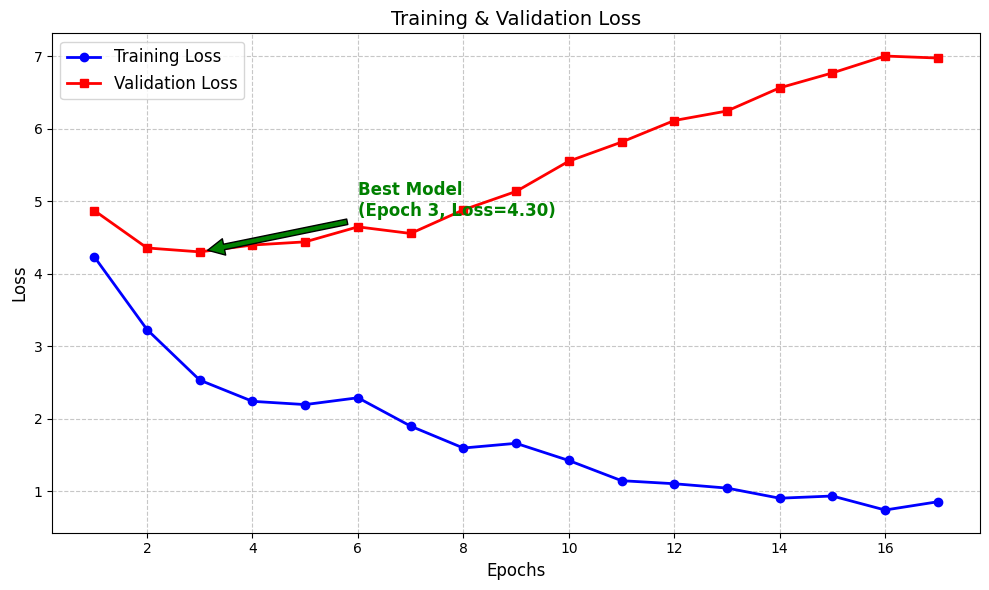

#  VietTableVQA: Trích xuất thông tin bảng biểu tiếng Việt (OCR-free)

Dự án xây dựng mô hình hỏi đáp trên bảng biểu (TableVQA) dành riêng cho tiếng Việt, sử dụng kiến trúc **Donut (Swin Transformer + BART)** tiếp cận hướng OCR-free.

##  Điểm nổi bật
- **OCR-free:** Học trực tiếp từ pixel ảnh, loại bỏ sai số từ các bộ OCR truyền thống.
- **Vietnamese Optimized:** Tối ưu hóa Tokenizer và Fine-tune trên dữ liệu báo cáo tài chính, thống kê Việt Nam.
- **VRAM Optimized:** Áp dụng Gradient Accumulation để huấn luyện trên hạ tầng hạn chế.

##  Kết quả huấn luyện
Dựa trên thực nghiệm, mô hình đạt trạng thái tốt nhất tại **Epoch 3** (Checkpoint-48) trước khi xảy ra hiện tượng Overfitting.

*Chỉ số ANLS đạt ~0.03 (Độ chính xác ký tự ~97%) trên tập dữ liệu thử nghiệm.*

##  Tech Stack
- **Framework:** PyTorch, Hugging Face Transformers.
- **Model Core:** Donut (naver-clova-ix/donut-base).
- **Tools:** OpenCV, MediaPipe, Weights & Biases.
